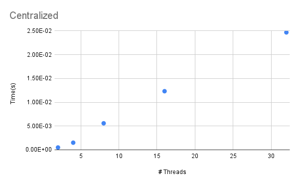
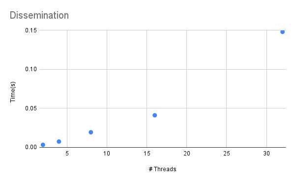
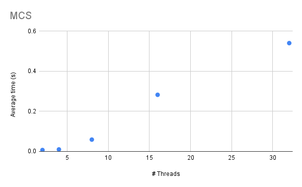

# A

To run my code,

```
    make
```
and then

```
    ./barriers
```
See the associated functions (disseminationBarrier, centralizedBarrier, MCPBarrier) in the main file for the implementations of each barrier.
# B

For proof of correctness, I ran each of my barriers with different numbers of threads and added print statements so you can see the barrier go through every stage appropriately.
Here is an example of output for each barrier type with 8 threads.

Centralized Barrier

```
    main() : creating thread, 0
    main() : creating thread, 1
    main() : creating thread, 2
    main() : creating thread, 3
    main() : creating thread, 4
    main() : creating thread, 5
    main() : creating thread, 6
    main() : creating thread, 7
    Waiting for counter==P. Thread ID: 0
    Waiting for counter==P. Thread ID: 1
    Waiting for counter==P. Thread ID: 3
    Waiting for counter==P. Thread ID: 4
    Waiting for counter==P. Thread ID: 6
    Waiting for counter==P. Thread ID: 5
    Waiting for counter==P. Thread ID: 7
    Waiting for counter==P. Thread ID: 2
    Thread 2, moving on !
    Thread 5, moving on !
    Thread 0, moving on !
    Thread 1, moving on !
    Thread 6, moving on !
    Thread 7, moving on !
    Thread 3, moving on !
    Thread 4, moving on !
```

Dissemintation Barrier

```
    main() : creating thread, 0
    Thread: 0 in round 0, notifiying partner 2.
    main() : creating thread, 1
    main() : creating thread, 2
    main() : creating thread, 3
    main() : creating thread, 4
    main() : creating thread, 5
    main() : creating thread, 6
    Thread: 1 in round 0, notifiying partner 3.
    main() : creating thread, 7
    Thread: 3 in round 0, notifiying partner 5.
    Thread: 3 in round 1, notifiying partner 4.
    Thread: 4 in round 0, notifiying partner 6.
    Thread: 5 in round 0, notifiying partner 7.
    Thread: 5 in round 1, notifiying partner 6.
    Thread: 6 in round 0, notifiying partner 0.
    Thread: 6 Thread: 7 in round 0, notifiying partner 1.
    Thread: 7 in round 1, notifiying partner 0.
    Thread: 2 in round 0, notifiying partner 4.
    Thread: 2 in round 1, notifiying partner 5.
    Thread: 5 in round 2, notifiying partner 5.
    Thread: 5 moving on.
    Thread: 0 in round 1, notifiying partner 3.
    Thread: 0 in round 2, notifiying partner 0.
    Thread: 0 moving on.
    Thread: 1 in round 1, notifiying partner 2.
    Thread: 2 in round 2, notifiying partner 6.
    in round 1, notifiying partner 1.
    Thread: 6 in round 2, notifiying partner 2.
    Thread: 6 moving on.
    Thread: 4 in round 1, Thread: 3 in round 2, notifiying partner 7.
    notifiying partner 7.
    Thread: 4 in round 2, notifiying partner 4.
    Thread: 4 moving on.
    Thread: 1 in round 2, notifiying partner 1.
    Thread: 1 moving on.
    Thread: 2 moving on.
    Thread: 7 in round 2, notifiying partner 3.
    Thread: 7 moving on.
    Thread: 3 moving on.
```

MCS Barrier: For this one, I had five print statements. 
1. When thread is created in main
2. When thread enters barrier
3. When thread is set on the way up then "sleeps"
4. When thread is waiting for parent on way down
5. When exiting the barrier

Here's an example output. I'm not totally convinced its 100% correct but testing it it doesn't look to bad. 
```
    main() : creating thread, 0
    main() : creating thread, 1
    main() : creating thread, 2
    main() : creating thread, 3
    main() : creating thread, 4
    main() : creating thread, 5
    main() : creating thread, 6
    main() : creating thread, 7
    Thread: 0 entered, child 1 = 1, child 2 = 2, parent 0
    Thread: 1 entered, child 1 = 3, child 2 = 4, parent 0
    Thread: 3 entered, child 1 = 7, child 2 = 8, parent 1
    Thread: 5 entered, child 1 = 11, child 2 = 12, parent 2
    Thread 5 set, now going to sleep
    Waiting for parent on thread 5
    Thread: 4 entered, child 1 = 9, child 2 = 10, parent 1
    Thread 4 set, now going to sleep
    Waiting for parent on thread 4
    Thread: 7 entered, child 1 = 15, child 2 = 16, parent 3
    Thread 7 set, now going to sleep
    Waiting for parent on thread 7
    Thread: 6 entered, child 1 = 13, child 2 = 14, parent 2
    Thread 6 set, now going to sleep
    Waiting for parent on thread 6
    Thread: 2 entered, child 1 = 5, child 2 = 6, parent 0
    Thread 2 set, now going to sleep
    Waiting for parent on thread 2
    Thread 3 set, now going to sleep
    Waiting for parent on thread Thread 1 set, now going to sleep
    Waiting for parent on thread 1
    Thread 0 set, now going to sleep
    Exiting Barrier - Thread: 0
    Exiting Barrier - Thread: 1
    Exiting Barrier - Thread: 4
    Exiting Barrier - Thread: 3
    Exiting Barrier - Thread: 7
    Exiting Barrier - Thread: 2
    Exiting Barrier - Thread: 5
    Exiting Barrier - Thread: 6
```


# C

I structured my code in a weird way and didn't have time to change it. My thread number was a global variable, so I just ran it by hand for multiple thread lengths for each of the functions 3 times, then took an average of the times.

# D
Here is the data and the graphs for each type. 
The columns are Thread # and time(s) respectively

Centralized
```
    2	4.91E-04
    4	0.0015014
    8	0.0055737
    16	0.0123202
    32	0.0246805
```


Dissemination
```
    2	0.003307
    4	0.007442
    8	0.019399
    16	0.041175
    32	0.148053
```


MCS
```
    2	0.007037
    4	0.010039
    8	0.059065
    16	0.282624
    32	0.540599
```


# E

As far as scaling, it seems that MCS would scale the best based on my implementation. MCS seems to be level off for higher threads, while Centralized looks like it may be more logarithmic. Dissemination looks roughly linear. It make sense that centralized looks logarithmic becaue we learned it class that the network messages can be O(N!) or unbounded. If I had a rather simple program that I wanted to use little space, I would use a centralized barrier. If I was concered with speed of critical path, I would choose a Dissemination. For the general case, I would go with MPC. I think my numbers for MPC make sense given that it is used in practice (which makes me think that it would scale well), but it also could be due to issues with my implementation. 

My computer has 2 cores and 4 threads. This makes sense, cause if you look at the output for some of my runs, the 
threads tend to pop up in groups of two. It also makes sense that the higher numbers took a lot longer, like 16 and 32 threads. I would have liked to try running this on patty if I had time, but I think that the barriers worked about how they were supposed to even though my machine was limited. I think that on a machine with more threads, Dissemination would look more linear, as it should with a constant critical path. 
